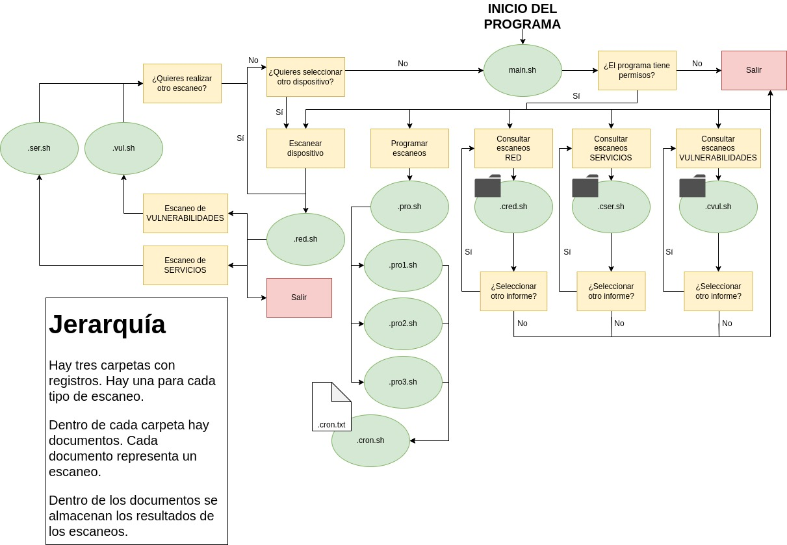

# Gestion-de-Escaneos
Proyecto de Shell Script, Dialog, Nmap e Iptables
# Notas:
- Por motivos de permisos se recomienda tener todos los scripts en el mismo directorio.
- En principio trabajamos sobre la rama develop y cuando consideremos el proyecto terminado se fusiona con main.

# Distribución

Esta es una representación generalizada de las partes que les toca a cada uno.
En realidad no nos limitamos a lo que pone en la tabla, es una orientación.

| Mario | Jaime | Ismael | David |
| :---:   | :---: | :---: | :---: |
| .vul.sh | .ser.sh | .red.sh | main.sh |
| .cvul.sh | .cser.sh | .cred.sh | pro*.sh |
| VUL/ | SER/ | RED/ | cron |
